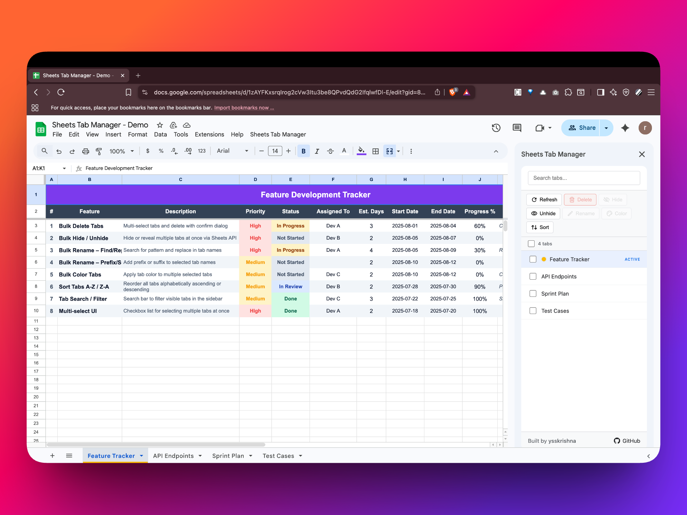
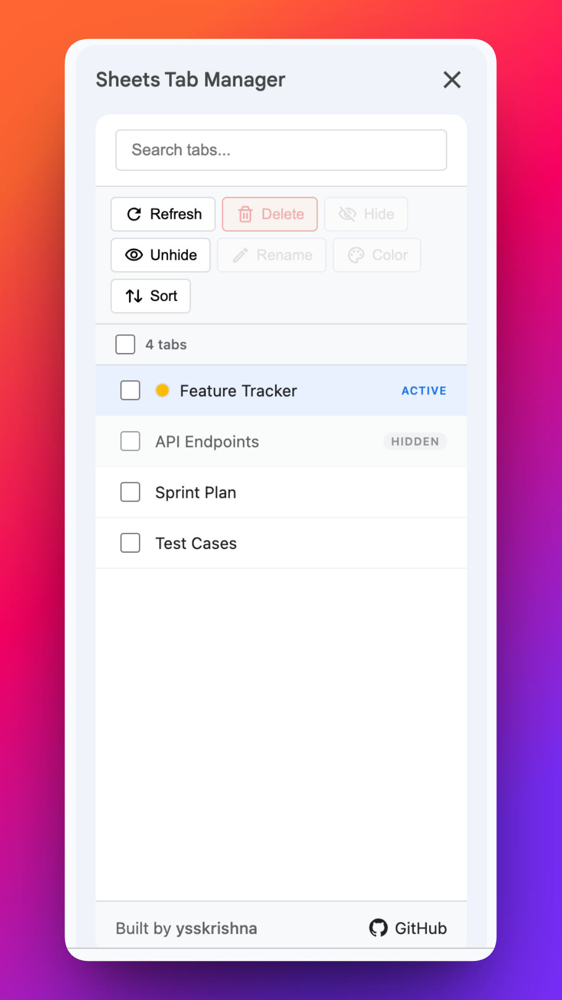
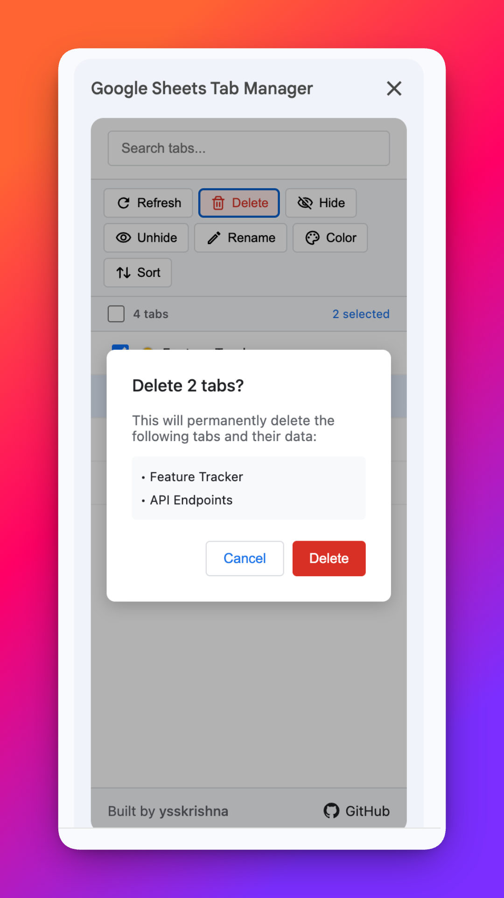
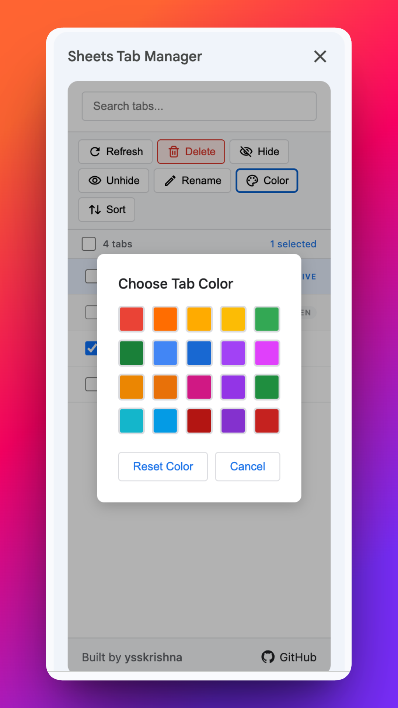
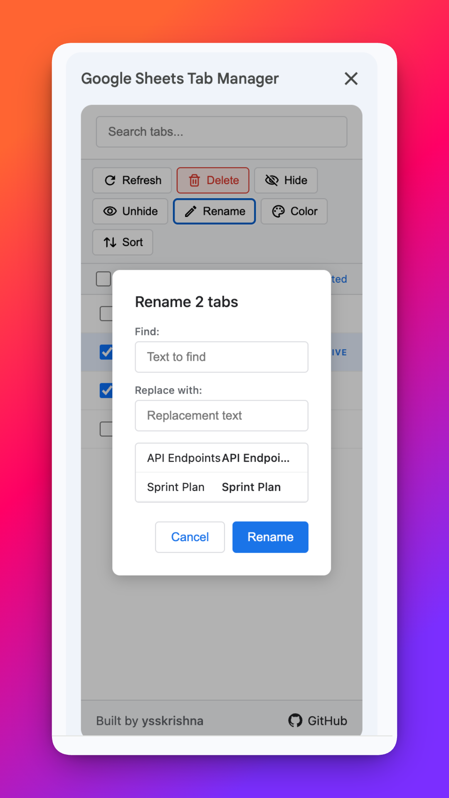
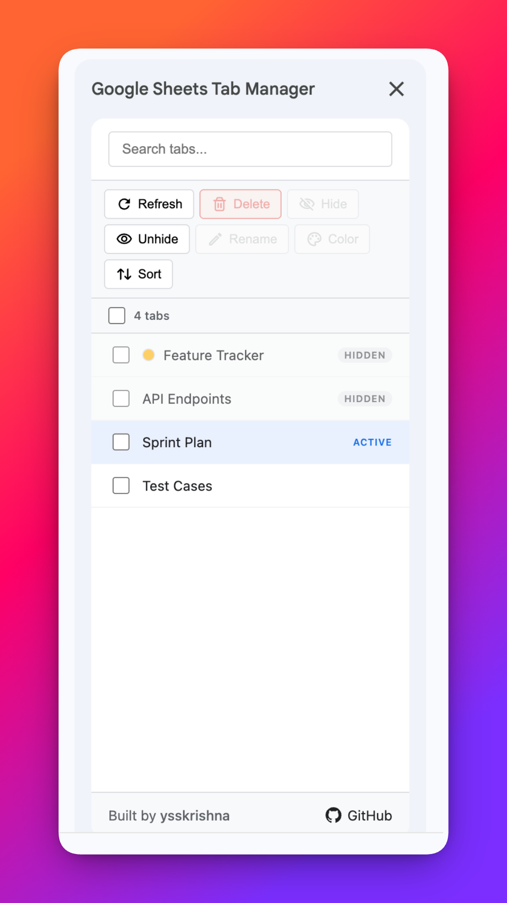

# Google Sheets Tab Manager

A Google Sheets Add-on for bulk managing tabs.

## Features
- **Bulk delete tabs** - multi-select and delete with confirmation
- **Bulk hide tabs** - hide selected tabs from the tab bar
- **Bulk unhide tabs** - unhide the selected hidden tabs from the tab bar
- **Bulk rename tabs** - rename one tab, or find/replace across several selected tab names
- **Bulk color tabs** - apply tab color to multiple tabs
- **Sort tabs** - reorder tabs A-Z or Z-A
- **Tab search/filter** - search bar to find tabs

## Links
- **Home**: https://ysskrishna.github.io/google-sheets-tab-manager/
- **Changelog**: https://ysskrishna.github.io/google-sheets-tab-manager/changelog.html
- **Terms of Service**: https://ysskrishna.github.io/google-sheets-tab-manager/terms.html
- **Privacy Policy**: https://ysskrishna.github.io/google-sheets-tab-manager/privacy.html
- **Support**: https://ysskrishna.github.io/google-sheets-tab-manager/support.html

## Screenshots

## Author

Built and maintained by **Y. Siva Sai Krishna**.

[Author's GitHub](https://github.com/ysskrishna) • [Author's LinkedIn](https://www.linkedin.com/in/ysskrishna)
