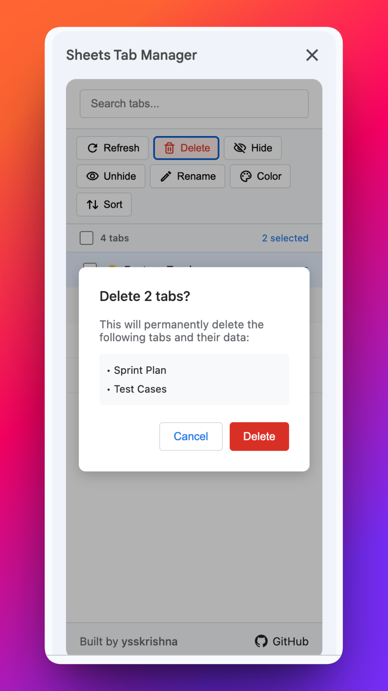
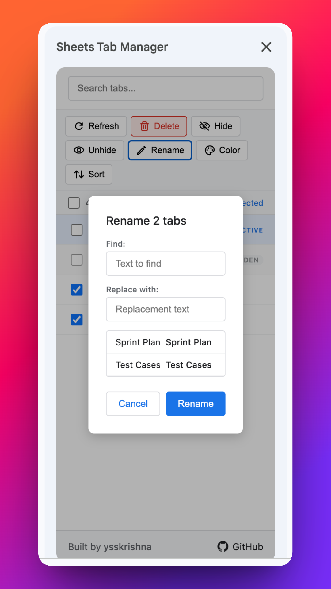
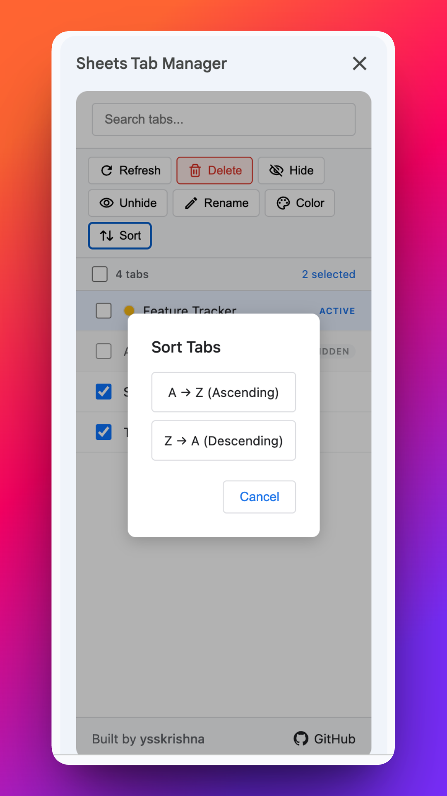

# Sheets Tab Manager

    

Google Sheets add-on for managing multiple tabs at once - delete, hide, rename, color, and sort with ease

## Features
- **Bulk delete tabs** - multi-select and delete with confirmation
- **Bulk hide tabs** - hide selected tabs from the tab bar
- **Bulk unhide tabs** - unhide the selected hidden tabs from the tab bar
- **Bulk rename tabs** - rename one tab, or find/replace across several selected tab names
- **Bulk color tabs** - apply tab color to multiple tabs
- **Sort tabs** - reorder tabs A-Z or Z-A
- **Tab search/filter** - search bar to find tabs

## Screenshots

## Author

Built and maintained by **Y. Siva Sai Krishna**.

[Author's GitHub](https://github.com/ysskrishna) • [Author's LinkedIn](https://www.linkedin.com/in/ysskrishna) • [Add to Google Sheets](https://workspace.google.com/marketplace/app/sheets_tab_manager/430663965462) • [Documentation](https://ysskrishna.github.io/google-sheets-tab-manager/) • [Product page](https://www.ysskrishna.space/products/57-google-sheets-tab-manager) • [More Google Workspace add-ons](https://www.ysskrishna.space/products?category=google-workspace-add-ons) • [Sheets Tab Manager blog](https://www.ysskrishna.space/blog/tag/google-sheets-tab-manager)
